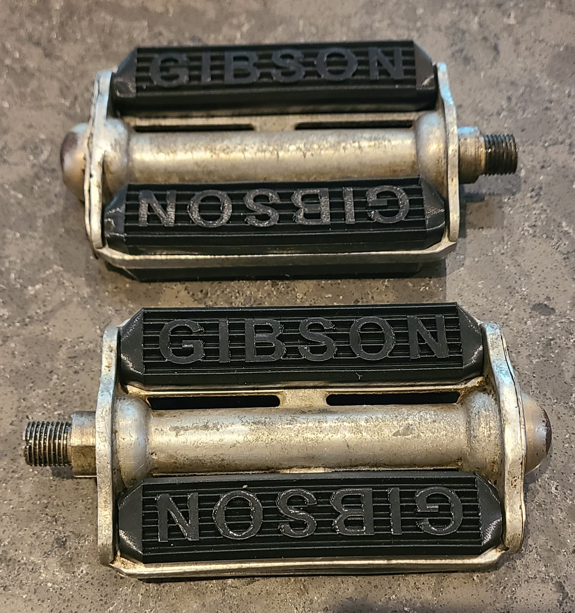
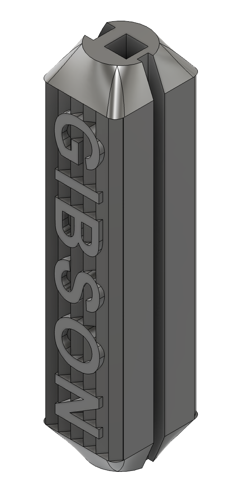

# Gibson Bicycle Pedal Insert

3D-printable replacement insert for vintage Gibson bicycle pedals.

These black plastic inserts were originally used in Gibson bicycle
pedals. This project provides a modern replacement that can be
3D-printed for restoration purposes.

## Status

**Version:** 1.0  
**Tested:** Yes — fit tested on an original Gibson bicycle pedal

This is an independent reproduction and is not affiliated with or
endorsed by Gibson.

## Files

- `CAD/`: source CAD files
- `3D-print/`: 3MF and STL files for printing
- `docs/PRINTING.md`: printing recommendations
- `docs/DIMENSIONS.md`: dimensions and measurements

## Printing

Recommended starting settings:

- Material: TPU
- Layer height: 0.20 mm
- Walls: 4
- Infill: 20%
- Supports: No
- Brim: 10 mm outer brim
- Orientation: Print vertically

The part should be printed at 100% scale. It will use about 25 g of TPU plastic.

See [PRINTING.md](docs/PRINTING.md) for additional information.

## Installation

Align the insert with the pedal opening and press it into place until
it is fully seated.

Check the fit carefully before using the bicycle.

## Background

This model was created as a replacement for the original rubber
pedal insert found on vintage Gibson bicycle pedals.

Also viewable and downloadable from the [F360 website here](https://a360.co/4dgqYPB).

Discussion and reference material:

[The CABE Gibson Pedals thread](https://thecabe.com/forum/threads/gibson-pedals-thread-post-up-your-gibson-photos.224916/)
[Vintage CCM thread](https://www.vintageccm.com/content/gibson-pedals)

## License

This model is licensed under the
[Creative Commons Attribution 4.0 International License (CC BY 4.0)](https://creativecommons.org/licenses/by/4.0/).

Copyright © 2026 Normand Cyr.

You are free to share, modify, and commercially use this model,
provided appropriate credit is given to the original creator.
