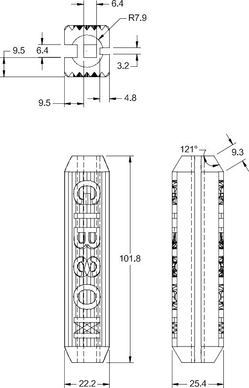

# Dimensions

Use the CAD files in `../CAD/` as the source of truth for exact
dimensions, and print the part at 100% scale.

Drawing files can be found in `../Drawings/`.

The model was created from measurements of an original Gibson pedal
insert.

## Main dimensions

All dimensions are in millimetres. The nominal dimensions shown on the
drawing are:

| Dimension | Nominal value |
| --- | ---: |
| Overall length | 101.6 mm |
| Transverse dimension | 22.2 mm |
| Lateral dimension | 25.4 mm |
| Central opening | 6.4 mm |
| End radius | R7.8 mm |
| Top angle | 121° |

The exported STL and 3MF measure approximately 22.225 x 101.775 x 25.400
mm. Print at 100% scale.

The drawing also contains the smaller feature dimensions and should be used
for those details. Verify the fit against the pedal before use.

## Reference discussion

The CABE: Gibson Pedals thread:
<https://thecabe.com/forum/threads/gibson-pedals-thread-post-up-your-gibson-photos.224916/>

The original part was measured directly; dimensions were not obtained
from a manufacturer's CAD file.
